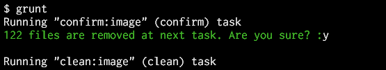
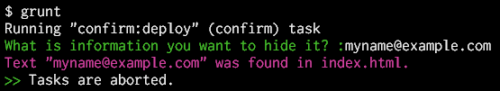

# grunt-confirm

Abort or continue the tasks flow according to an answer to the question, the tasks pause and wait it.  
This differs from others in that you specify the question and you specify how to determine to abort or continue.

Example:





## Getting Started
This plugin requires Grunt `~0.4.1`

If you haven't used [Grunt](http://gruntjs.com/) before, be sure to check out the [Getting Started](http://gruntjs.com/getting-started) guide, as it explains how to create a [Gruntfile](http://gruntjs.com/sample-gruntfile) as well as install and use Grunt plugins. Once you're familiar with that process, you may install this plugin with this command:

```shell
npm install grunt-confirm --save-dev
```

Once the plugin has been installed, it may be enabled inside your Gruntfile with this line of JavaScript:

```js
grunt.loadNpmTasks('grunt-confirm');
```

## The "confirm" task

In your project's Gruntfile, add a section named `confirm` to the data object passed into `grunt.initConfig()` (see [Configuring tasks](http://gruntjs.com/configuring-tasks)).

### Options

#### question
Type: String or Function

The String that is specified or returned by specified Function is shown to user on screen.  
If specified Function returns falsy (e.g. `null`, `undefined`, `''`, `false` etc.), this task is finished immediately. And the tasks flow is to be continued.

The specified Function is passed `files` argument. This is standard Grunt `files` components (see [Files](http://gruntjs.com/configuring-tasks#files)).  
The Function can make the question text by using it.

Example:

`Gruntfile.js`

```js
grunt.initConfig({
  confirm: {
    build: {
      options: {
        // Static text.
        question: 'This processing require about 10 minutes. Continue?',
        continue: function(answer) {
          return answer.toLowerCase() === 'y';
        }
      }
    }
  },
  // Other tasks...
});
```

```js
grunt.initConfig({
  confirm: {
    deploy: {
      src: '<%= copy.deploy.src %>', // refer to another task
      options: {
        question: function(files) {
          var count = 0;
          files.forEach(function(f) { count += f.src.length; });
          return !count ? '' : // No file. And do nothing.
            count + ' files are copied at next task. Are you sure?';
        },
        continue: function(answer) {
          return answer.toLowerCase() === 'y';
        }
      }
    }
  },
  copy: {
    deploy: {
      expand: true,
      cwd: 'src/',
      src: '**/*.html',
      dest: 'public_html/'
    }
  }
});
```

#### continue
Type: Boolean or Function

If `false` is specified or specified Function returns falsy (e.g. `null`, `undefined`, `''`, `false` etc.), this tasks flow is aborted immediately. And the remaining tasks will be not done. Otherwise the tasks flow is to be continued.

The specified Function is passed `answer` and `files` arguments. The `answer` is value that was typed by user. The `files` is standard Grunt `files` components (see [Files](http://gruntjs.com/configuring-tasks#files)).  
The Function can determine to abort or continue by using those.

Example:

`Gruntfile.js`

```js
grunt.initConfig({
  confirm: {
    init: {
      options: {
        // Just pause, don't abort. e.g. for show something on screen.
        question: 'Push Enter key to continue.',
        continue: true
      }
    }
  },
  // Other tasks...
});
```

```js
grunt.initConfig({
  confirm: {
    pack: {
      src: '<%= another.pack.src %>', // refer to another task
      options: {
        question: 'How many files are required?',
        continue: function(answer, files) {
          var count = 0;
          files.forEach(function(f) { count += f.src.length; });
          if (count < +answer) {
            grunt.log.writeln('There are only ' + count + ' files.');
            return false;
          } else {
            return true;
          }
        }
      }
    }
  },
  // Other tasks...
});
```

## See Also
+ If you want to more process, consider [grunt-task-helper](https://github.com/anseki/grunt-task-helper).
+ Highlighting the question text like the images at top of this document may be better. [colors](https://github.com/Marak/colors.js) is useful for that.

```js
require('colors');
grunt.initConfig({
  confirm: {
    setup: {
      options: {
        question: 'Can you see me?'.green.bold,
        continue: true
      }
    }
  }
});
```

## History
 * 2014-09-17			v0.1.0			Initial release.
